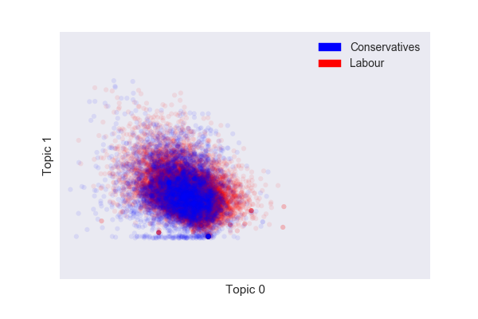

# Understanding Politics Through Language

This project consists of two main components:

1. A Scrapy spider to crawl the Hansard archive of UK parliamentarians and their debate contributions into a PostgreSQL database.
2. A natural language processing toolkit to produce insights and visualisations that aid citizens in understanding the politicians that represent them.

As a very preliminary taste of the aims of the project, I have prepared two graphs:

First, a graph of two dimensional latent semantic indexing vectors from the spoken debate contributions of the 5 highest ranking members in the cabinet and shadow cabinet, in the UK House of Commons. There appears to be a large overlap of the topics that are discussed between the two parties, which would be expected without further processing of the data.

Second a graph of two dimensional word vectors for the terms *'economy', 'education', 'defence', 'health', 'transport', and 'environment'*, from the same members of parliament. Word vectors represent how words are used with respect to the rest of a language. There is a separation between the two parties, possibly linked to the ways in which they talk about the selected subjects.

These results are unoptimised and the dimensionality reduction parameters have not been tuned, but the figures offer a representation of how we might begin to distill the opinions and positions of politicians, by their language into visuals.

### Future Aims

- [ ] To connect language analysis with voting record
